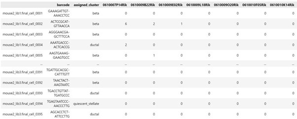

# Batch-corrected scETM
This project is the final project of ZJUI ECE449 course. It's a batch effect corrected scETM model dealing with single cell annotation assignment. 

>* Coworkers
>* Dataset
>* 

## Coworkers' Information
Yao Wentao - ZJUI institute
Liu Chang  - ZJUI institute
Xu ke      - ZJUI institute

## Dataset
We use 4 batches of Human’s data, each with 8569 cells by 20125 gene/cell and 2 batches of mouse’s data, each with 1886 cells by 14878 gene/cell. The Human pancreatic islet dataset come from the GEO or EMBL-EBI database under the accession codes GSE81076, GSE85241, GSE86469, E-MTAB-5061, and GSE84133. Mice’s comes from the GEO database under the accession code GSE84133.
In the dataset, each row represents all gene expression of a cell, each column represents all cell’s gene expression of a certain gene. There are also barcode showing the origin of the cell and cell label showing ground truth cell type.

To download the dataset we use, view the following link:

<https://zjuintl-my.sharepoint.com/:f:/g/personal/zitai_19_intl_zju_edu_cn/EuOqRKUn_PFEiWY4hn9NIGYBgODxu6iNuQsGoF_Tybz2cg?e=WoQ6gH>

## Program usage
We have writen it in a jupyter notebook file, what you have to do is to download the dataset and all the files, put the dataset files in the same hierachy with the other files. Then you can run the human.ipynb or mouse.ipynb.

## 
